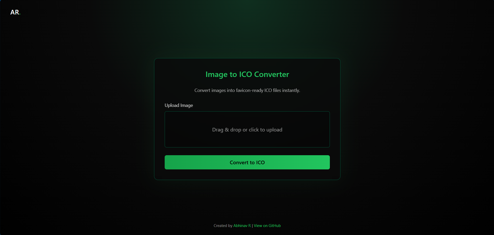
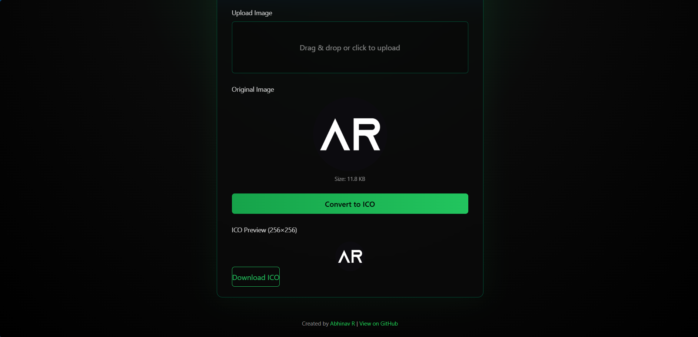

# 🟢 Image to ICO Converter

A modern, lightweight **Image → ICO converter** that runs entirely in the browser.  
Convert any image into a **favicon-ready 256×256 ICO file** with instant preview and download.

Built with a **dark + neon green futuristic UI**, no backend, and fully deployable on **Vercel / GitHub Pages**.

## 📸 Preview

  

  

## ✨ Features

- 📤 Upload images via **click or drag & drop**
- 👁️ Live **original image preview**
- 📐 Automatic resize to **256×256 resolution**
- 🧩 Converts PNG buffer into a valid **ICO file**
- 👀 Preview generated icon before download
- ⬇️ One-click **ICO download**
- ⚡ Fully client-side (no server, no uploads)
- 🌙 Dark theme with neon green accents
- 📱 Mobile-responsive UI

---

## 🔄 Conversion Workflow

User uploads image
↓
Image is loaded & validated
↓
Original preview shown
↓
Image resized into 256×256 icon
↓
PNG buffer combined into ICO
↓
Preview icon displayed
↓
ICO file downloaded

---

## 🛠️ Tech Stack

- HTML5  
- Tailwind CSS (CDN)  
- Vanilla JavaScript (ES Modules)  
- Canvas API  
- Custom local PNG → ICO engine  

> No frameworks. No backend. No external JS dependencies.

---

## 📁 Project Structure

ico-converter/
└── public/
├── index.html # UI & layout
├── script.js # Application logic
├── png-to-ico.js # Local ICO generator
└── favicon.ico # Site favicon

## 👨‍💻 Author

**Abhinav R**

[GitHub](https://github.com/abhinavr-19)

[LinkedIn](https://www.linkedin.com/in/abhinav-r-a2b970286)